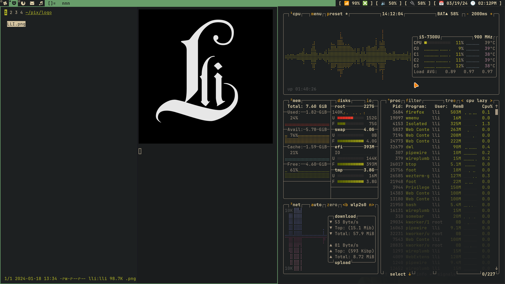

## General Information 💻
- **OS:** Void Linux
- **Wallpapers:** The Witcher
- **Color Theme:** Gruvbox Hard Dark
- **Fonts:** JetBrains Mono Nerd Font,
- **Session Manager:** NULL
- **Compositor:** DWL
- **Terminal:** Foot
- **Shell:** Bash
- **Fish Theme:** Starship
- **Application Launcher:** Wmenu
- **Power Menu:** Wmenu
- **Network Menu:** Wmenu
- **Pdf Reader:** Zathura
- **Code Editor:** Vscode, Nvim
- **Search Engine:** Firefox
### Screenshot:

  <h1>⚜️ GAME OVER ⚜️</h1>

